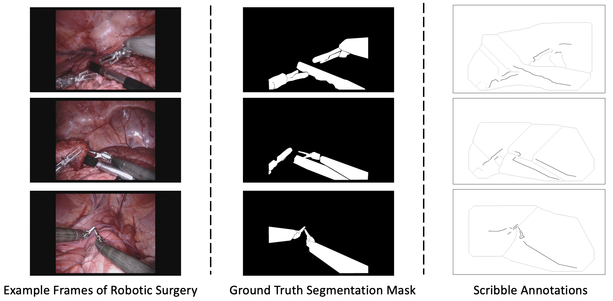

## CV-WSL-Robot
Exploring CNN and ViT for Weakly-Supervised Surgical Tool Segmentation

## Demo Picture




## Requirements
* [Pytorch]
* Some basic python packages such as Numpy, Scikit-image, SimpleITK, Scipy, Medpy ......

## Datasets
In this project, we use MICCAI Robotic Instrument Segmentation Challenge 2017 [Official Link](https://arxiv.org/abs/1902.06426).


## Usage

1. Clone the repo:
```
git clone https://github.com/ziyangwang007/CV-WSL-Robot.git
cd CV-WSL-Robot
```
2. Download the pre-processed data 

Download the pre-processed data and put the data in `../data/robotic`.  You can download the pre-processed dataset for Weakly-Supervised Learning study purpose, i.e. scribble annotation.

Google Drive [Google Drive Link](https://drive.google.com/file/d/1bL-gFBtOIfdA2hG_ih7-UKJH3KwcT0jH/view?usp=sharing), or Baidu Netdisk [Baidu Netdisk Link](https://pan.baidu.com/s/14I4-srriko6k_DV5Kjwb6g) with passcode: '8zf8'.


3. Train the model

```
cd code

python train_Ours_Weakly_Consistency_Robot_2D.py 
```

4. Test the model

```
python test_2D_fully_ViT.py

or 

python test_2D_fully.py

or 

python test_2D_vit.py

```

## Reference
